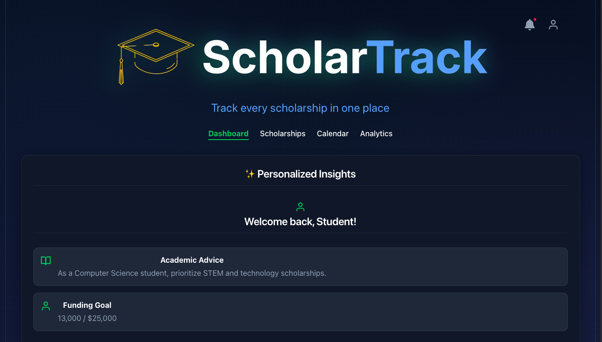
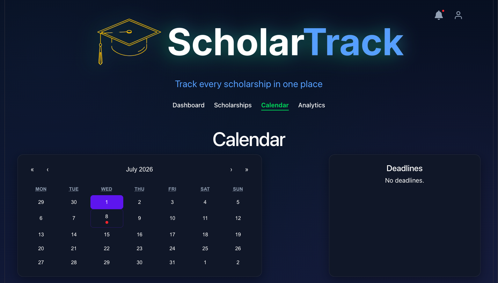

# 🚀 ScholarTrack — Real-Time Academic Funding Analytics Dashboard

ScholarTrack is an enterprise-ready, real-time tracking application dashboard platform built to empower students to discover, track, organize, and submit their academic scholarship funding profiles with zero friction.

🔗 **Live Production Deployment URL**: scholarship-tracker-ruf1.vercel.app (https://vercel.app)

---

## 🎨 Visual System Walkthrough

| 📱 Real-Time System Workspaces | 🗓️ Memoized Calendar Systems |
| --- | --- |
|  |  |

---

## ⚡ Core Application Architecture Highlights

* **Secure Authentication Gates**: Encapsulated login validation workflows using Google OAuth 2.0 and structural Email/Password verification schemes built via Firebase Auth.
* **Secure Route Interceptors**: Client-side navigational boundary controls (`ProtectedRoute`) that guard dashboard metrics and automatically bounce unauthenticated users back to the login portal.
* **Context-Driven State Infrastructure**: Application data architecture driven entirely by a unified React Context Provider Engine, completely eliminating prop-drilling layouts.
* **Private Cloud Data Sync**: Bidirectional real-time document data replication streams built via Google Firestore NoSQL collections, sandboxed securely under unique user IDs.
* **O(1) Data Optimization Engine**: Optimized deadline iteration workflows utilizing memoized hash mapping dictionaries (`useMemo`) inside the calendar view, reducing lookup footprints from $O(N)$ down to $O(1)$ and eliminating client-side rendering bottlenecks.
* **Checklist Matrix Handlers**: Fluid milestone tracking logic computing dynamic requirement fraction outputs and interactive checkbox toggle states natively synced to the cloud.

---

## 🛠️ Technology Stack Ecosystem

| Layer | Choice | Function Assignment |
| --- | --- | --- |
| **Frontend Core** | React v18 + Vite | Modular UI component design and ultra-fast hot module replacement development. |
| **Routing Manager** | React Router DOM v6 | Seamless, instant multi-page user view navigation and semantic layout URL mapping. |
| **Backend & Database** | Google Firebase & Firestore NoSQL | Encrypted user access tokens, secure session monitoring, and real-time document sync. |
| **Quality Control** | Vitest + React Testing Library | Automated virtual UI environment assertions and component-level regression test runners. |
| **Asset Utilities** | React Icons & React Hot Toast | High-utility dashboard iconography and fluid contextual popups. |

---

## 💻 Local Workspace Initialization Sandbox

To clone and initialize this application ecosystem inside your local sandbox workspace, run these layout terminal steps:

### 1. Download and Step into Project Folder
```bash
git clone https://github.com
cd scholarship-tracker
```

### 2. Install Project Dependencies
```bash
npm install
```

### 3. Setup Your Secure Cloud Credentials Environment
Create an `.env.local` document inside your root folder boundary line and pass your corresponding Firebase API access tokens:

```env
VITE_FIREBASE_API_KEY=your_copied_api_key
VITE_FIREBASE_AUTH_DOMAIN=your_project_://firebaseapp.com
VITE_FIREBASE_PROJECT_ID=your_project_id
VITE_FIREBASE_STORAGE_BUCKET=your_project_://appspot.com
VITE_FIREBASE_MESSAGING_SENDER_ID=your_messaging_sender_id
VITE_FIREBASE_APP_ID=your_app_id
```

### 4. Boot Up the Development Instance
```bash
npm run dev
```

### 5. Fire off the Automated Unit Test Suites
```bash
npm run test
```
